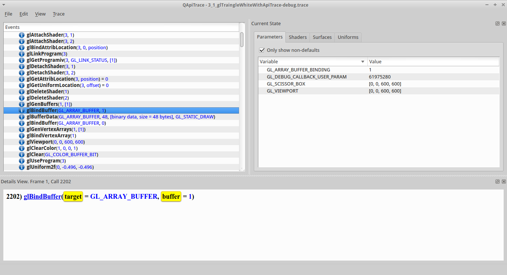
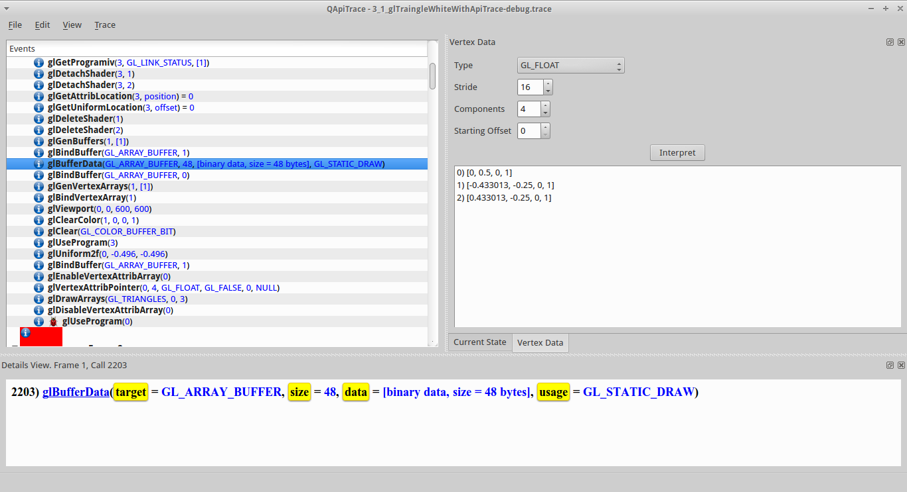
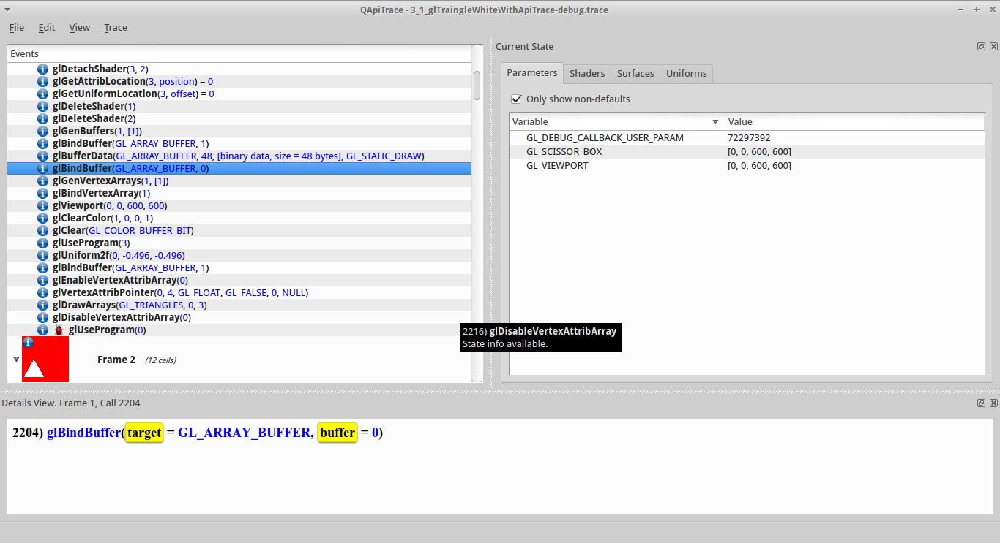

#Apitrace - Generate Buffers

##glGenBuffers

- [main.cpp line 243 in our C++ code](https://github.com/shearer12345/graphics_examples_in_git_branches/blob/glTraingleWhiteWithApiTrace/main.cpp#L243)
```C++
glGenBuffers(1, &positionBufferObject);
```

- [glGenBuffers](https://www.opengl.org/sdk/docs/man4/html/glGenBuffers.xhtml) generate buffer object names
- returns n buffer object names in buffers
- in this case only 1 name is asked for, and return, the ID of buffer object is **1**


##glGenBuffers - context

- new buffer objects (in this case just 1) are created
- the buffer object is empty
- the **ID/name** for the buffer object is stored in the address passed in
- nothing else has changed

TODO - diagram of context, based on 

##glBindBuffer

- [main.cpp line 245 in our C++ code](https://github.com/shearer12345/graphics_examples_in_git_branches/blob/glTraingleWhiteWithApiTrace/main.cpp#L245)
```C++
glBindBuffer(GL_ARRAY_BUFFER, positionBufferObject);
```

- [glBindBuffer](https://www.opengl.org/sdk/docs/man4/html/glBindBuffer.xhtml) binds a buffer object to the specified buffer binding point
- in this case the buffer object is ID=**1** (our positionBufferObject) is bound as the GL\_ARRAY\_BUFFER
    - you can see this change in the OpenGL state (parameters tab)



##glBindBuffer - context

- the **GL\_ARRAY\_BUFFER\_BINDING** is now set to **1**
- nothing else has changed

TODO - diagram of context, based on 

##glBufferData

- [main.cpp line 246 in our C++ code](https://github.com/shearer12345/graphics_examples_in_git_branches/blob/glTraingleWhiteWithApiTrace/main.cpp#L246)
```C++
glBufferData(GL_ARRAY_BUFFER, sizeof(vertexPositions), vertexPositions, GL_STATIC_DRAW);
```

- [glBufferData](https://www.opengl.org/sdk/docs/man4/html/glBufferData.xhtml) creates and initializes a buffer object's data store.
- Takes 4 parameters:
    - target
    - size
    - data
    - usage
- Note the **Vertex Data** tab that now shows in ApiTrace
    - It is the **glBufferData** call that **copies** our CPU data to OpenGL
    - This data is now visible in the debugger
        - Note: it is just 48 bytes, we can choose how to interpret it
    - These are detailed more in the next section


##glBufferData (parameters)

- GLenum target
    - Specifies the target to which the buffer object is bound.
    - In this case = **GL\_ARRAY\_BUFFER**, which is used to store vertex attributes
- GLsizeiptr size
    - the size in **bytes** of the buffer object's new data store.
    - in this case **48** bytes (our array has **12 elements**, each of which are **GL_FLOAT**s (each **32-bits **of precision == **4 bytes**)  **12*4=48**
- const GLvoid * data
    - a pointer to data that will be **copied** into the data store for initialization, or NULL if no data is to be copied.
    - in this case, a pointer to the **vertexPositions** array
- GLenum usage
    - the expected usage pattern of the data store
    - in this case, **GL\_STATIC\_DRAW**
        - STATIC means **data store contents will be modified once and used many times.**
        - DRAW means **data store contents are modified by the application, and used as the source for GL drawing and image specification commands.**
- you can see this change in the OpenGL state (parameters tab)


##glBufferData (byte interpretation)

- we can choose how the bytes in the buffer object are interpreted in Vertices
- we will have to specify this when we want to use the buffer object for rendering
- in the following example, ApiTrace is set to interpret vertices as groups of 4 GL_FLOATS, with a 16 byte jump from one group to the next



##glBufferData - context

- new graphics memory is allocated for the buffer
- the graphics memory is **filled** with the bytes from **vertexPositions**
- nothing else has changed
    - specifically, we **have not** told OpenGL **how** to interpret the bytes

TODO - diagram of context, based on 

##glBindBuffer (unbinding)

- [main.cpp line 247 in our C++ code](https://github.com/shearer12345/graphics_examples_in_git_branches/blob/glTraingleWhiteWithApiTrace/main.cpp#L247)
```C++
glBindBuffer(GL_ARRAY_BUFFER, 0);
```

- [glBindBuffer](https://www.opengl.org/sdk/docs/man4/html/glBindBuffer.xhtml) binds a buffer object to the specified buffer binding point
- in this case the buffer object is ID=**0**
    - **0** has the meaning on **no buffer**, so no buffer is any longer bound
    - you can see this change in the OpenGL state (parameters tab)
        - GL\_ARRAY\_BUFFER\_BINDING no longer shows as it is back on its default value



##glBindBuffer (unbinding) - context

- the **GL\_ARRAY\_BUFFER\_BINDING** is now set to **0** (meaning no buffer)
- nothing else has changed

TODO - diagram of context, based on 

