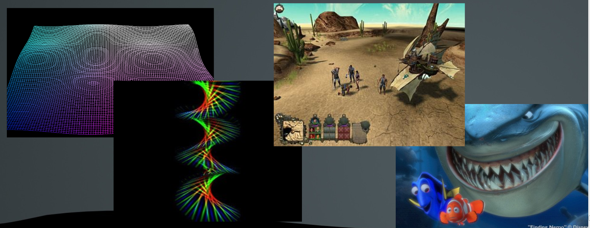

---
title: lincoln Lectures On Graphics - 01
author: shearer12345
---

---
title: What Is Computer Graphics
author: shearer12345
---

#The purpose of graphics

- The purpose of graphics of any kind is to determine what color to put in what pixels
- This determination is what makes text look like text, windows look like windows, and so forth

#3D Graphics?

- Images are just a two-dimensional array of pixels
  - So, how does 3D work?
- 3D graphics is some system of producing colors for pixels that convince you that the scene you are looking at is a 3D world rather than a 2D image
- The process of converting a 3D world into a 2D image of that world is called projection

#human perception

What visual features are important for human perception?

- ???

#human perception?

What visual features are important for human perception?

- in 2D images of 3D scenes
    - i.e. 3D perception / depth perception

#3D perception

visual features important for 3D perception:

- Perspective - viewpoint, projection (size, shape, field of view) also, how straight/parallel lines converge. - any good examples for each, and optical illusions for each?
- Focus, depth of field
- Shading, specular highlights
- Shadows
- Stereoscopic
- Obscuring - things in front
- changes in all of these

#3D perception activities

- Stereoscopic
    - activity: finger thing / "camera 1, camera 2" (Wayne's-World-1992)
- Obscuring - things in front
    - activity: get 2 volunteers, get one to hold something and stand against a wall, get class to look at the thing, get other volunteer to walk parallel to wall, between thing and class, what do class notice?

#Rasterization

- There are several methods for rendering a 3D world
- Real-time graphics hardware, such as that found in your computer, involves a very great deal of fakery
- This approach is called rasterization  and has some constraints:
  - all objects that you see are empty shells (surfaces only)
  - **Everything is a shell**
  - Techniques exists to cut open these empty shells, but they simply replace parts of the shell with more shells that shows what the inside looks like

#How hard are those visual features to simulate?

- Algorithmically?
- Computationally?

#Visual simulation difficulty?

- Algorithmically?
- Computationally?

    - Perspective - viewpoint, projection (size, shape, field of view) also, how straight/parallel lines converge.
    - Focus, depth of field
    - Shading, specular highlights
    - Shadows
    - Stereoscopic
    - Obscuring - things in front
    - changes in all of these

#Which visual features does OpenGL support, and how easily?

- ...

#OpenGL visual feature support

- ? Perspective - viewpoint, projection (size, shape, field of view) also, how straight/parallel lines converge.
- ? Focus, depth of field
- ? Shading, specular highlights
- ? Shadows
- ? Stereoscopic
- ? Obscuring - things in front
- ? changes in all of these

%whyIsComputerGraphicsHard
%shearer12345

#Why do you think?

#What do we mean by Computer Graphics

- ???

#What do we mean by Computer Graphics

- interactive
- 3D
- generating of a sequence of static 2D projections of 3D scenes fast enough and realistically enough to trick the human eye into "seeing" smooth 3D motion

See [whatIsComputerGraphics](whatIsComputerGraphics.html)

#What Kinds of Factors

- human-ones
- physical ones (about the real world)
- computational ones

#Some things that make it hard

- Needing to do lots fast
- the maths etc
- the algorithms
- computational limits
    - cpu time
    - ram?
- program limits (api or other)
- the cpu/api/gpu boundaries etc

#Let's do some back of the envelope Maths

- ...
- how much "work" do we need to do?

#Let's do some back of the envelope Maths

- how many pixels per frame
    - to look ok/good
    - projector?
    - HD?
    - ...
- how many frames per second
    - to trick our eyes into seeing motion

#How many pixels per frame

- to look ok/good
- normal projector = 1024 x 768 ~= 750,000 pixels
- FullHD = 1920 x 1080 ~= **2,000,000 pixels**

Note: for appproximation using 2 million pixels

#How many frames per second

- to trick our eyes into seeing motion
    - 25fps -> 100fps
    - aim for **50fps** or 60fps
    - 
Note: for appproximation using 50fps

#How many pixels per second?

- ????

#How many pixels per second?

- 2,000,000 pixels per frame
- times
- 50 frames per second

#How many pixels per second?

- 2,000,000 pixels per frame
- times
- 50 frames per second
- = 100,000,000 pixels per second

#How many computational processing is needed?

- ???

% toolchain
% shearer12345

#Toolchain for graphics

- OpenGL - graphics rendering
- SDL2 - context creation, windowing, input handling
- C / C++ - programming
- premake - solution creation, supporting:
  - gmake
  - code::blocks
  - Visual Studio

#OpenGL

- a C library for graphics rendering
- usually utilises the underlying hardware graphics accelerator (graphics card)

#SDL2

- context creation, windowing, input handling
- OpenGL **only** does rendering, we need other tools for a number of jobs:
  - to setup a "context" that OpenGL can use
  - to create and manipulate windows
  - to handle input
  - ...

#C / C++

- OpenGL provides a C-style API (Application Program Interface)
- that API can be used from C or C++
- or the API can be wrapped for use from other languages (e.g. Java, Python)

#Premake

>Describe your software project just once, using Premake's simple and easy to read syntax, and build it everywhere. Generate project files for Visual Studio, GNU Make, Xcode, Code::Blocks, and more across Windows, Mac OS X, and Linux. Use the full featured Lua scripting engine to make build configuration tasks a breeze.
  - [http://industriousone.com/premake](http://industriousone.com/premake)

- using premake 4.4 (beta5), which supports upto Visual Studio 2012
  - later versions are supported by importing and upgrading the project in VS
  - [premake4.4-beta5](http://industriousone.com/topic/premake-44-beta5-now-available)

