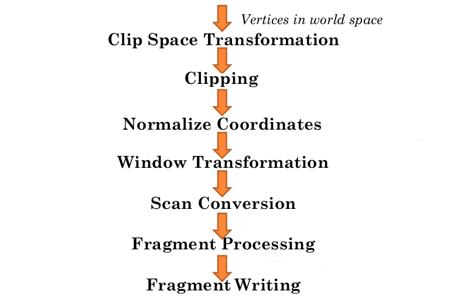
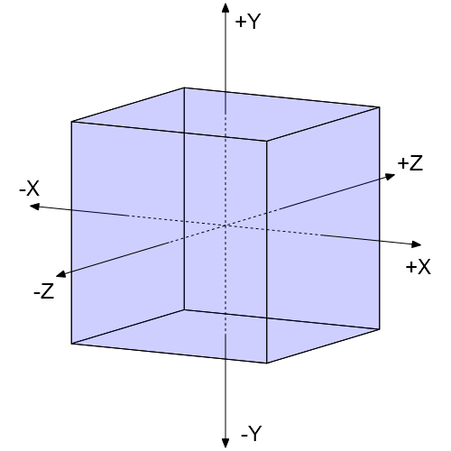
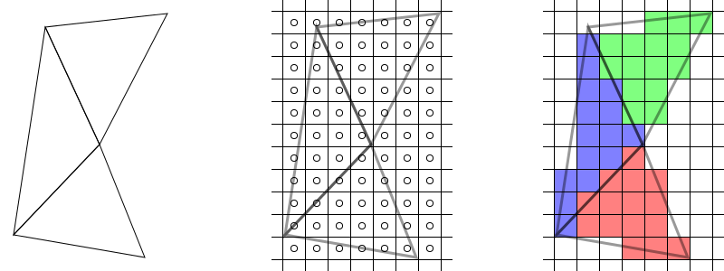
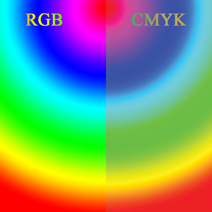

---
title: lincoln Lectures On Graphics - 03
author: shearer12345
---

#Pipeline Overview

##Putting the **"Fun"** in Fundamentals

#
##Vertices in World Space

The pipeline is fed (*somehow, we'll cover later*) with **vertices** in **WORLD SPACE** (or **Object Space**)

\ 

#
##Clip Space Transformation

- Transform the vertices into a certain region of space
    - in OpenGL this is called **clip space**
- Also known as **projection transformation**
    - [http://arcsynthesis.org/gltut/Basics/Intro%20Graphics%20and%20Rendering.html](http://arcsynthesis.org/gltut/Basics/Intro%20Graphics%20and%20Rendering.html)
    - you get to **program** this bit (GLSL - vertex shader)

\ 

#
##Homogeneous Coordinates!!

- X,Y,Z and W!!!
    - W defines what the extents of clip space are for this vertex (-W to W on X, Y, Z)
- The process of transforming vertices into clip space is arbitrary (stupid)
    - OpenGL provides a lot of flexibility in this step
    - i.e. **programmable** flexibility!
- We'll cover homogeneous coordinates more later
    - http://www.tomdalling.com/blog/modern-opengl/explaining-homogenous-coordinates-and-projective-geometry/
    - http://www.songho.ca/math/homogeneous/homogeneous.html

#
##Vertices in Clip Space

\ 

#
##Normalized Device Coordinates

- Clip space is interesting, but inconvenient
    - the extent of this space is different for each vertex, which makes visualizing a triangle rather difficult
- The X, Y, and Z of each vertex's position is divided by W to get normalized device coordinates
    - basically the same as clip space except that the range of X, Y and Z are **[-1, 1]**

#
##Vertices in Normalized Device Coordinates

\ 

#
##Clipping

- Triangles not **fully** in **clip space** (the [-1,1] cube) we want to **clip**

\ 

#
##Clipping 2

- Points are easy to test in our new, normalised coordinate space (NDC)
- Lines are more difficult
- Triangles are complicated
    - may need to make more triangles

#
##Vertices in Clipped NDC

\ 

#
##Window Transformation

- Transform from normalized device coordinates towindow coordinates
   - window coordinates are relative to the window that OpenGL is running within
- Though they refer to the window, they are still three dimensional coordinates
    - still floating-point values
    - still have a z-coordinates!! Why?? Stay-tuned ...
    - bottom-left position is the origin (0, 0)

#
##Vertices in Window Coordinates

\ 

#
##Scan Conversion

- After conversion to window coordinates the triangle undergoes a process called **scan conversion**
    - also known as **rasterization**
- Takes the triangle and generates fragments that cover the area of the triangle
    - also fills in pixels for lines
- We'll look later at how scan conversion can be done

#
##Scan Conversion (triangles again)

- Image in the centre shows the digital grid of output pixels
    - the circles represent the centre of each pixel, the centre of each pixel represents a **sample**:
        - a discrete location within the area of a pixel

\ 

#
##Scan Conversion (more triangles)

- During scan conversion, a triangle will produce a **fragment** for every pixel sample that is within the 2D area of the triangle (right)
    - a rough **approximation** of the triangle's general shape

\ 

#
##Scan Conversion
###Shared Edges and ***the invariance guarantee*** (By Tom Clancy)

- triangles that share edges are very often rendered (unless you’re making asteroids)
- OpenGL offers the invariance guarantee
    - so long as shared edge vertex positions are **identical**, there will be no sample gaps during scan conversion
- What would happen otherwise??

\ 

#
##Scan Conversion (Still??)

- Scan conversion only uses X and Y position of the triangle in window coordinates to determine which fragments to generate
    -  the Z value is not forgotten!
- The result of scan converting a triangle is a sequence of fragments that cover the shape of the triangle
    - each fragment has data associated with it
        - the 2D location of the fragment in window coordinates
        - the Z position of the fragment
        - (a.k.a. known as the depth of the fragment)
        - there may be other information that is part of a fragment

#
##Fragments

\ 

#
##Fragment Processing

- Fragment processing takes a fragment from scan converted triangle and **transforms** it into
   - one or more colour values
   - a single depth value (z value)
   - you get to **program** this bit (GLSL - fragment shader)
- The order that fragments from a single triangle are processed in is irrelevant
    - *unlike* the order that triangles are pumped into the pipeline, a single triangle lies in a **single plane** so fragments generated from it **cannot overlap**
- **However**, the fragments from another triangle might
- ***Therefore, fragments from one triangle must all be processed before fragments from another triangle***

#
##Processed Fragments

\ 

#
##Fragment Writing (maybe)

- After generating one or more colours and a depth value
    - the fragment is **possibly** written to the destination (probably a frame buffer)
    - **What might control this?**
- This step involves more than simply writing to the destination image
    - These will be covered more later

#
##Colours

-  The usual description of a colour is as a series of numbers on the range **[0, 1] ***Why [0,1]?*
    - each of the numbers corresponds to the **intensity** of a particular reference colour
    - the final colour represented by the series of numbers is a mix of these reference colours
- The set of reference colours is called a **colour space**.
    - the most common colour space for screens is RGB, where the reference colours are Red, Green and Blue
    - printed works tend to use CMYK (Cyan, Magenta, Yellow, Black)]

\ 

#
##Colours 2

- Combining different intensities of this 3 colours, we can generate and display millions of different colour shades in OpenGL
    - how many colours? what is the usual representation?
        - [http://en.wikipedia.org/wiki/Color_depth#Deep_color_.2830.2F36.2F48-bit.29](http://en.wikipedia.org/wiki/Color_depth#Deep_color_.2830.2F36.2F48-bit.29)
    - in most conditions more than the human eye can perceive
        - any *special conditions?*
    - unless you're a tetrachromat ... [http://www.post-gazette.com/pg/06256/721190-114.stm](http://www.post-gazette.com/pg/06256/721190-114.stm)

#
##Shaders

- A shader is a program designed to be run on a renderer as part of the rendering operation
- Regardless of the kind of rendering system in use, shaders can only be executed at certain points in the rendering process
- These shader stages represent hooks where we can insert our code to create specific visual effects, for example:
    - transformation of an incoming vertex to clip space is a useful hook for user-defined code
    - the processing of a fragment into final colours and depth

#
##Shaders 2 (GLSL)

- Shaders for OpenGL are run on the actual rendering hardware so free up valuable CPU time for other tasks
    - and **usually** the graphics card has orders of magnitude more raw, though specialist processing power available
    - GeForce GTX 760 Ti - **2460 GFLOPS** single-precision!!
- Or perform operations that would be difficult if not impossible without the flexibility of executing arbitrary code
    - however, they live within certain limits that CPU code would not have to ...
    - ?? any guess what limits ??
- There are a number of shading languages available to various APIs. The one used here is the primary shading language of OpenGL, the **OpenGL Shading Language**, or **GLSL**. for short
    - It looks deceptively like C, **but it is very much not C**

#
##Shaders 3 (GLSL)

```GLSL
#version 330

layout(location = 0) in vec4 position;
uniform float loopDuration;
uniform float time;

void main()
{
	float timeScale = 3.14159f * 2.0f / loopDuration;
	
	float currTime = mod(time, loopDuration);
	vec4 totalOffset = vec4(
		cos(currTime * timeScale) * 0.5f,
		sin(currTime * timeScale) * 0.5f,
		0.0f,
		0.0f);

	gl_Position = position + totalOffset;
}
```

#Links about Graphics

- a general list
- and related interesting stuff
- peruse at your leisure

#
##OpenGL 3.0 onwards

- [http://open.gl/](http://open.gl/)
- [http://duriansoftware.com/joe/An-intro-to-modern-OpenGL.-Chapter-1%3a-The-Graphics-Pipeline.html](http://duriansoftware.com/joe/An-intro-to-modern-OpenGL.-Chapter-1%3a-The-Graphics-Pipeline.html)
- [http://www.arcsynthesis.org/gltut/](http://www.arcsynthesis.org/gltut/)
- [https://bitbucket.org/alfonse/gltut/src](https://bitbucket.org/alfonse/gltut/src)
- [http://en.wikibooks.org/wiki/OpenGL_Programming/Modern_OpenGL_Introduction](http://en.wikibooks.org/wiki/OpenGL_Programming/Modern_OpenGL_Introduction)
- [http://www.daveshreiner.com/SIGGRAPH/s11/Modern-OpenGL.pdf](http://www.daveshreiner.com/SIGGRAPH/s11/Modern-OpenGL.pdf)
- [http://fgiesen.wordpress.com/2011/07/09/a-trip-through-the-graphics-pipeline-2011-index/](http://fgiesen.wordpress.com/2011/07/09/a-trip-through-the-graphics-pipeline-2011-index/)

#
##OpenGL 3.0 onwards 2

- [http://gamedev.stackexchange.com/questions/32876/good-resources-for-learning-modern-opengl-3-0-or-later](http://gamedev.stackexchange.com/questions/32876/good-resources-for-learning-modern-opengl-3-0-or-later)
- [https://github.com/g-truc/ogl-samples](https://github.com/g-truc/ogl-samples)
- OpenGLSuperBible (6th edition) Examples [https://github.com/openglsuperbible/sb6code/tree/master/src](https://github.com/openglsuperbible/sb6code/tree/master/src)
- Open Media Engine OpenGL 4 Tutorials [http://openme.gl/opengl-4-tutorial-code/](http://openme.gl/opengl-4-tutorial-code/)
- OpenGL 4.3/4.4 example using SDL2 and GLM [http://openme.gl/opengl-4-x-example-using-sdl2-and-glm/](http://openme.gl/opengl-4-x-example-using-sdl2-and-glm/)
- Swiftless tutorials [http://www.swiftless.com/opengl4tuts.html](http://www.swiftless.com/opengl4tuts.html)
- http://www.tomdalling.com/blog/category/modern-opengl/

#
##Context Creation (mostly SDL2)

- https://open.gl/context
- [https://www.libsdl.org/index.php](https://www.libsdl.org/index.php)
- [https://www.youtube.com/watch?v=MeMPCSqQ-34](https://www.youtube.com/watch?v=MeMPCSqQ-34)
- [https://github.com/BennyQBD/ModernOpenGLTutorial](https://github.com/BennyQBD/ModernOpenGLTutorial)
- [https://www.youtube.com/watch?v=ftiKrP3gW3k&list=PLEETnX-uPtBXT9T-hD0Bj31DSnwio-ywh](https://www.youtube.com/watch?v=ftiKrP3gW3k&list=PLEETnX-uPtBXT9T-hD0Bj31DSnwio-ywh)
- Setting up SDL2 in Visual Studio (2013 or any other) [www.programmersranch.com/2014/02/sdl2-setting-up-sdl2-in-visual-studio.html](www.programmersranch.com/2014/02/sdl2-setting-up-sdl2-in-visual-studio.html)
- 2D tutorials with SDL2 [http://lazyfoo.net/tutorials/SDL/index.php](http://lazyfoo.net/tutorials/SDL/index.php)
- SDL2 migration guide [https://wiki.libsdl.org/MigrationGuide](https://wiki.libsdl.org/MigrationGuide)

#
##Context Creation (non-SDL)

- Unofficial OpenGL Software Development Kit [http://glsdk.sourceforge.net/docs/html/index.html](http://glsdk.sourceforge.net/docs/html/index.html)
- FreeGlut [http://freeglut.sourceforge.net/](http://freeglut.sourceforge.net/)
- Simple and Fast Multimedia Library [http://www.sfml-dev.org/](http://www.sfml-dev.org/)
- GLFW [http://www.glfw.org/](http://www.glfw.org/)

#
##platform-specific Context Creation

```C
#include <windows.h>
#include <GL/GL.h>

#pragma comment (lib, "opengl32.lib")

LRESULT CALLBACK WndProc(HWND hWnd, UINT message, WPARAM wParam, LPARAM lParam);

int WinMain( __in HINSTANCE hInstance, __in_opt HINSTANCE hPrevInstance, __in_opt LPSTR lpCmdLine, __in int nShowCmd )
{
        MSG msg          = {0};
        WNDCLASS wc      = {0}; 
        wc.lpfnWndProc   = WndProc;
        wc.hInstance     = hInstance;
        wc.hbrBackground = (HBRUSH)(COLOR_BACKGROUND);
        wc.lpszClassName = L"oglversionchecksample";
        wc.style = CS_OWNDC;
        if( !RegisterClass(&wc) )
                return 1;
        CreateWindowW(wc.lpszClassName,L"openglversioncheck",WS_OVERLAPPEDWINDOW|WS_VISIBLE,0,0,640,480,0,0,hInstance,0);

        while( GetMessage( &msg, NULL, 0, 0 ) > 0 )
                DispatchMessage( &msg );

        return 0;
}
```

#

```C
LRESULT CALLBACK WndProc(HWND hWnd, UINT message, WPARAM wParam, LPARAM lParam)
{
        switch(message)
        {
        case WM_CREATE:
                {
                PIXELFORMATDESCRIPTOR pfd =
                {
                        sizeof(PIXELFORMATDESCRIPTOR),
                        1,
                        PFD_DRAW_TO_WINDOW | PFD_SUPPORT_OPENGL | PFD_DOUBLEBUFFER,    //Flags
                        PFD_TYPE_RGBA,            //The kind of framebuffer. RGBA or palette.
                        32,                        //Colordepth of the framebuffer.
                        0, 0, 0, 0, 0, 0,
                        0,
                        0,
                        0,
                        0, 0, 0, 0,
                        24,                        //Number of bits for the depthbuffer
                        8,                        //Number of bits for the stencilbuffer
                        0,                        //Number of Aux buffers in the framebuffer.
                        PFD_MAIN_PLANE,
                        0,
                        0, 0, 0
                };
```

#

```C
                HDC ourWindowHandleToDeviceContext = GetDC(hWnd);

                int  letWindowsChooseThisPixelFormat;
                letWindowsChooseThisPixelFormat = ChoosePixelFormat(ourWindowHandleToDeviceContext, &pfd); 
                SetPixelFormat(ourWindowHandleToDeviceContext,letWindowsChooseThisPixelFormat, &pfd);

                HGLRC ourOpenGLRenderingContext = wglCreateContext(ourWindowHandleToDeviceContext);
                wglMakeCurrent (ourWindowHandleToDeviceContext, ourOpenGLRenderingContext);

                MessageBoxA(0,(char*)glGetString(GL_VERSION), "OPENGL VERSION",0);

                wglDeleteContext(ourOpenGLRenderingContext);
                PostQuitMessage(0);
                }
                break;
        default:
                return DefWindowProc(hWnd, message, wParam, lParam);
        }
        return 0;

}
```

#
##Extensions Wrangling

- Manual function loading! [https://open.gl/context#Onemorething](https://open.gl/context#Onemorething)
- OpenGl Extension Wrangler Library (GLEW) [http://glew.sourceforge.net/](http://glew.sourceforge.net/)
- gl3w [https://github.com/skaslev/gl3w](https://github.com/skaslev/gl3w)
- gl3w with SDL2 example [https://github.com/progschj/OpenGL-Windowing-Examples/blob/master/sdl2.cpp](https://github.com/progschj/OpenGL-Windowing-Examples/blob/master/sdl2.cpp)
- Lazy Foo on Modern OpenGL [http://lazyfoo.net/tutorials/SDL/51_SDL_and_modern_opengl/index.php](http://lazyfoo.net/tutorials/SDL/51_SDL_and_modern_opengl/index.php)

#
##Object-orientated OpenGL (OGLplus, C++)

- [http://oglplus.org/](http://oglplus.org/)
- OGLplus tutorials [http://oglplus.org/oglplus/html/oglplus_tutorials.html](http://oglplus.org/oglplus/html/oglplus_tutorials.html)

#
##using git

- [http://programmaticallyspeaking.com/code-demo-using-git.html](http://programmaticallyspeaking.com/code-demo-using-git.html)
- Try Github [https://try.github.io/levels/1/challenges/1](https://try.github.io/levels/1/challenges/1)
- Git: the simple guide [http://rogerdudler.github.io/git-guide/](http://rogerdudler.github.io/git-guide/)
- Git Immersion [http://gitimmersion.com/](http://gitimmersion.com/)
- Github Guides [https://guides.github.com/](https://guides.github.com/)
- Ungit [https://github.com/FredrikNoren/ungit](https://github.com/FredrikNoren/ungit)
    - Ungit Introduction Video [https://www.youtube.com/watch?v=hkBVAi3oKvo&feature=youtu.be](https://www.youtube.com/watch?v=hkBVAi3oKvo&feature=youtu.be)
- git-big-picture (for summarising git trees) [https://github.com/esc/git-big-picture](https://github.com/esc/git-big-picture)


#
##Debugging tools

- [apitrace - http://apitrace.github.io/](apitrace - http://apitrace.github.io/)
- VOGL:
    - [http://richg42.blogspot.de/2014/01/vogl-opengl-tracerdebugger-bonus-content.html](http://richg42.blogspot.de/2014/01/vogl-opengl-tracerdebugger-bonus-content.html)
    - [https://github.com/ValveSoftware/vogl](https://github.com/ValveSoftware/vogl)
    - [https://www.youtube.com/watch?v=45O7WTc6k2Y -Moving Your Games to OpenGL](https://www.youtube.com/watch?v=45O7WTc6k2Y)

#
##Build tools (Premake)

- Premake Website (a little out of date) [http://industriousone.com/premake](http://industriousone.com/premake)
- Premake repositories [https://bitbucket.org/premake/](https://bitbucket.org/premake/)
- Premake Meta (Premake quickstart scripts) [https://github.com/d-led/premake-meta-cpp](https://github.com/d-led/premake-meta-cpp)
- Example complex-ish Premake script from gltut [https://bitbucket.org/alfonse/gltut/src/1d1479cc7027f1e32c5adff748f3b296f1931d84/framework/framework.lua?at=default](https://bitbucket.org/alfonse/gltut/src/1d1479cc7027f1e32c5adff748f3b296f1931d84/framework/framework.lua?at=default)

#
##Matrices

- [www.opengl-tutorial.org/beginners-tutorials/tutorial-3-matrices/](www.opengl-tutorial.org/beginners-tutorials/tutorial-3-matrices/)

#
##Coordinate Systems

- http://www.matrix44.net/cms/notes/opengl-3d-graphics/coordinate-systems-in-opengl

#
##Homogeneous Coordinates

- http://www.tomdalling.com/blog/modern-opengl/explaining-homogenous-coordinates-and-projective-geometry/
http://www.songho.ca/math/homogeneous/homogeneous.html

#
##Engines

- unreal engine 4 on linux (and steamOS and windows and maybe xbox one)
    - [https://www.unrealengine.com/blog/unreal-engine-4-and-linux](https://www.unrealengine.com/blog/unreal-engine-4-and-linux)
    - [http://www.extremetech.com/gaming/179802-windows-apps-announced-for-xbox-one-is-steam-in-the-cards](http://www.extremetech.com/gaming/179802-windows-apps-announced-for-xbox-one-is-steam-in-the-cards)
- Open Media Engine [http://openme.gl/](http://openme.gl/)
    - A simple to use, general purpose, 3D media framework using OpenGL, OpenAL and OpenDE
- OGRE – Open Source 3D Graphics Engine [http://www.ogre3d.org/](http://www.ogre3d.org/)
- Crystal Space [http://www.crystalspace3d.org/main/Main_Page](http://www.crystalspace3d.org/main/Main_Page)
- Horde3D [http://www.horde3d.org/](http://www.horde3d.org/)

#
##Asset importing

**Note that SDL2 can load standard `.bmp` files on its own, but no other image formats**

- Open Asset Import Library [assimp.sourceforge.net/index.html](assimp.sourceforge.net/index.html)
- Resilient Image Library [sourceforge.net/projects/resil/](sourceforge.net/projects/resil/)
- Simple OpenGL Image Library [www.opengl-tutorial.org/miscellaneous/useful-tools-links/](www.opengl-tutorial.org/miscellaneous/useful-tools-links/)

#
##other

- unreal engine 4 to linux
    - [https://www.unrealengine.com/blog/41-update-preview](https://www.unrealengine.com/blog/41-update-preview)
- [http://pyopengl.sourceforge.net/context/tutorials/shader_1.html](http://pyopengl.sourceforge.net/context/tutorials/shader_1.html)
- [http://www.networkedgraphics.org/sigasia2011/part3.pdf](http://www.networkedgraphics.org/sigasia2011/part3.pdf)
- [http://goanna.cs.rmit.edu.au/~gl/teaching/Interactive3D/2011/lecture2.html](http://goanna.cs.rmit.edu.au/~gl/teaching/Interactive3D/2011/lecture2.html)
- [http://graphics.cs.illinois.edusvn/kcrane/web/index.html](http://graphics.cs.illinois.edusvn/kcrane/web/index.html)
- [http://www.ogre3d.org/index.php?option=com_content&task=view&id=17&Itemid=70](http://www.ogre3d.org/index.php?option=com_content&task=view&id=17&Itemid=70)
- [http://www.opengl.org/](http://www.opengl.org/)
- [https://software.intel.com/en-us/articles/quake-wars-gets-ray-traced/?wapkw=%28ray+tracing%29](https://software.intel.com/en-us/articles/quake-wars-gets-ray-traced/?wapkw=%28ray+tracing%29)

#
##other 2

- [https://www.youtube.com/watch?v=hapCuhAs1nA](https://www.youtube.com/watch?v=hapCuhAs1nA)
- [https://www.youtube.com/watch?v=VUxcVzpeFqc](https://www.youtube.com/watch?v=VUxcVzpeFqc)
- [http://www.mesa3d.org/llvmpipe.html](http://www.mesa3d.org/llvmpipe.html)


- [http://www.willusher.io/sdl2%20tutorials/2013/08/15/lesson-0-linux-command-line/](http://www.willusher.io/sdl2%20tutorials/2013/08/15/lesson-0-linux-command-line/)


