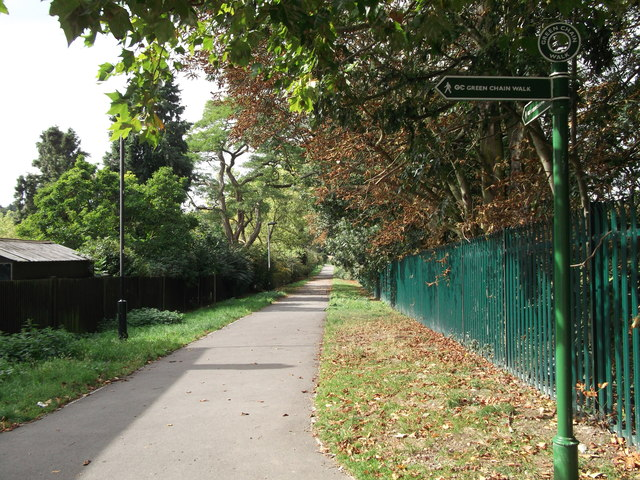
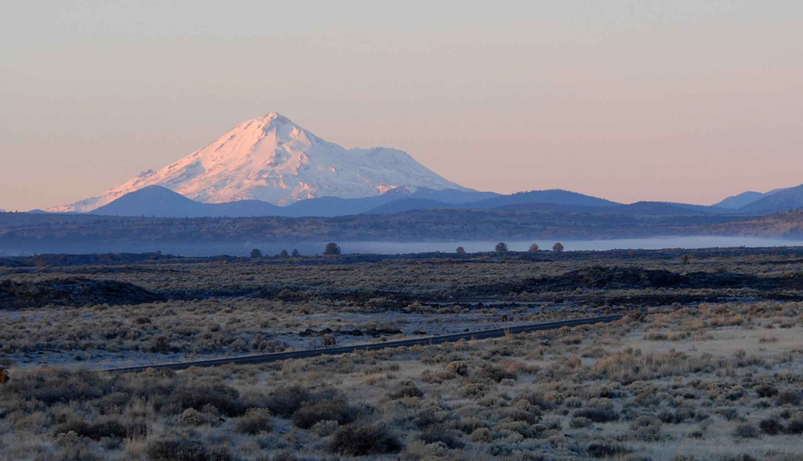

%WhatIsComputerGraphics
%shearer12345

#The purpose of graphics

- The purpose of graphics of any kind is to determine what color to put in what pixels
- This determination is what makes text look like text, windows look like windows, and so forth

#3D Graphics?

- Images are just a two-dimensional array of pixels
  - So, how does 3D work?
- 3D graphics is some system of producing colors for pixels that convince you that the scene you are looking at is a 3D world rather than a 2D image
- The process of converting a 3D world into a 2D image of that world is called projection

#What visual features are important for human perception?

- ???

#What visual features are important for human perception?

- in 2D images of 3D scenes
    - i.e. 3D perception / depth perception

Note: Perspective (viewpoint, projection (size, shape, field of view), how straight/parallel lines converge), Focus (& depth of field), Shading (& specular highlights), Shadows, Stereoscopy - do finger thing (camera 1, camera 2), Obscuring (things in front - do, get 2 volunteers, get one to hold something and stand against a wall, get class to look at the thing, get other volunteer to walk parallel to wall, between thing and class, what do class notice?)

#visual features important for 3D perception

- Perspective - viewpoint, projection (size, shape, field of view) also, how straight/parallel lines converge. - any good examples for each, and optical illusions for each?
- Focus, depth of field
- Shading, specular highlights
- Shadows
- Stereoscopic
    - activity: finger thing / "camera 1, camera 2" (Wayne's-World-1992)
- Obscuring - things in front
    - activity: get 2 volunteers, get one to hold something and stand against a wall, get class to look at the thing, get other volunteer to walk parallel to wall, between thing and class, what do class notice?
- changes in all of these

#Rasterization

- There are several methods for rendering a 3D world
- Real-time graphics hardware, such as that found in your computer, involves a very great deal of fakery
- This approach is called rasterization  and has some constraints:
  - all objects that you see are empty shells (surfaces only)
  - **Everything is a shell**
  - Techniques exists to cut open these empty shells, but they simply replace parts of the shell with more shells that shows what the inside looks like

#How hard are those visual features to simulate?

- Algorithmically
- Computationally

#Which visual features does OpenGL support, and how easily?

- ...
